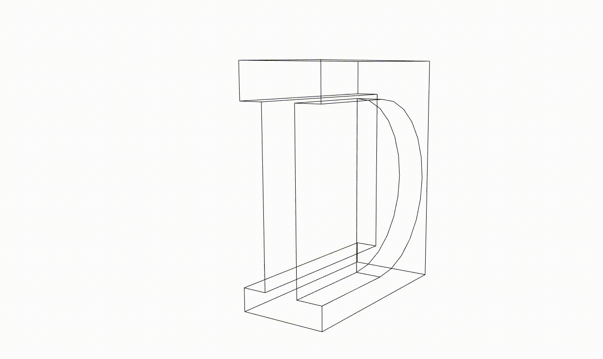

  

# RATIONALE #

* Internal branding gathered to apply to multiple digital strategies: mobile apps, webinars, social media etc. with a focus in accessibility.
* This repo is a living document that will grow and adapt over time

### What is this repository for? ###

* Quick summary
    - Branding digital assets for visual identity
      

### How do I get set up? ###

* Summary of set up
    - Check [colophon.md](colophon.md)
* Deployment instructions
    - Check [logotype accesibility.md](logotype_accesibility.md)
    - Check [chromatic aberrations.md](cromatic_aberrations.md)
    - [Preliminary logos](Preliminary_logos.md)

### Issues ###
* Check them on [here](https://bitbucket.org/imhicihu/branding/issues)

### Changelog ###
* Please check the [Commits](https://github.com/imhicihu/Branding/commits/master) section for the current status

### Who do I talk to? ###
* Repo owner or admin
    - Contact `imhicihu` at `gmail` dot `com`

### Code of Conduct
* Please, check our [Code of Conduct](code_of_conduct.md)

### Legal ###
* All trademarks are the property of their respective owners.

### License ###
* The content of this project itself is licensed under the MIT license.